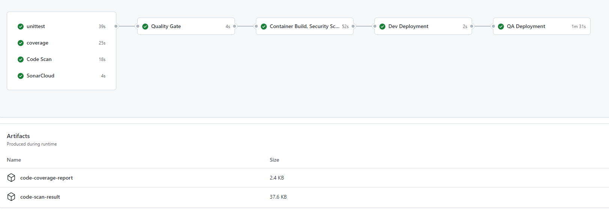

# pttgc-devops-lab02
This topic will introduce some of mandatory steps which usually are required in every real-world DevOps workflow. Attendees will have hands-on experience to create some of the steps mentioned in this module.

This module will consist of several exercise which will add jobs to your workflow one by one. At the end of this module, we should have workflow quite similar to this picture (Some jobs will be covered in later in this course)



## Exercise 1 - Create Unittest job
In this exercise we will create the unittest jobs for the provided sourcecode written in Golang. The unittest detail are vary between each programming language. If you want to reuse this step in your future project, please check documentation for the instruction to run unittest for your development language and adjust it accordingly.

- Create new repository in your github account, for example `devops-lab02`
- Create new directory `.github/workflows` and create the workflow YAML file, e.g. `lab02-workflow.yaml`
- Define the name of your workflow
```yaml
# You can use any name
name: Lab02 workflow
```

- Next is to specify the trigger to run this workflow, in this lab we will keep it simple by using `push` event
```yaml
# define the trigger for the workflow using push event on branch main (or other branch if you plan to use other branch than main)
on:
    push:
        branches:
            - main
```

- Then, define the job to run the unittest
```yaml
jobs:
    # You can use any name for this, but ensure that it make sense and easy to understand
    unittest: 
        name: Unit Test
        runs-on: ubuntu-latest
        steps:
            - uses: actions/checkout@v3 #Use checkout action to download the source code to run unittest
              name: Checkout
            - uses: actions/setup-go@v3 #Setup golang environment for runnint unittest
              name: Setup Go environment
              with:
                go-version-file: ./src/go.mod
            - name: Run Unit Test
              working-directory: ./src
              run: go test ./...
```

You can see that there are three steps, checkout code, setup environment and then execute the unittest

- Commit and Push the code, Then check the github UI to see the workflow is triggered and running
```sh
git add .
git commit -m "Add unittest workflow"
git push
```


## Exercise 2 - Code Coverage
Code coverage is the main factor to ensure the software quality, even we have integrate `unittest` and execute it every build, but it does not guarantee that developer will write unittest for all new feature that they introduce. So code coverage checking is very important to ensure that the new code that introduce to the software has been tested

- This exercise will reuse the workflow file from exercise 1
- Add new job name `code-coverage`
```yaml
    code-coverage:
        name: Code Coverage
        runs-on: ubuntu-latest
        steps:
            - uses: actions/checkout@v3 #Use checkout action to download the source code to run unittest
              name: Checkout
            - uses: actions/setup-go@v3 #Setup golang environment for runnint unittest
              name: Setup Go environment
              with:
                go-version-file: ./src/go.mod
            - name: Run Code Coverage checking
              working-directory: ./src
              run: go test -coverprofile coverage.out ./...
            - name: Reformat coverage report
              working-directory: ./src
              run: go tool cover -func coverage.out -o coverage.txt
            - name: Print out report
              working-directory: ./src
              run: cat coverage.txt
```

- Commit and Push the code, then check the github UI to see how the workflow is running

*Note: you can see that even though we have `unittest` put in place, but this repository does not have much of the unittest. Hence the quality of this code is quite low and likely to find the bug in the future. And this is why we need to have `code coverage` checking in the workflow*

### Quiz
Both job `unittest` and `code-coverage` contains the steps to checkout the sourcecode and setup golang environment. Do you know why can't we have only one place in `unittest` and `code coverage` also using it??

## Exercise 3 - Artifacts
The previous exercise we have succeed produce the coverage report. If you notice, we print out the report detail to the console. This is not the best practice. If you plan to use the report anywhere else, you need to use artifact

- From exercise 2, replace the step `Print out report` with this step instead
```yaml
            - name: Upload coverage report to artifact
              uses: actions/upload-artifact@v3
              with:
                name: code-coverage-report
                path: src/coverage.txt
```

- Commit and Push the code, then check the github UI to see how the workflow is running
- When the workflow finished, check the artifact. You can download the artifact to your local machine to examine it.

## Exercise 4 - Code vulnerability scan (trivy)
It also important to add security check to your code, so that the cost to fix is low. It's better than discover it in the later phase which usually very expensive to fix

- This exercise will reuse the same workflow as exercise 1&2
- Add new jobs name `code-vuln-scan`
```yaml
    code-vuln-scan:
        name: Code Vulnerability Scan
        runs-on: ubuntu-latest
        steps:
            - uses: actions/checkout@v3 #Use checkout action to download the source code to run unittest
              name: Checkout
            - uses: aquasecurity/trivy-action@master
              name: Vulnerability Scan
              with:
                scan-type: 'fs'
                ignore-unfixed: true
                format: 'sarif'
                output: 'trivy-results.sarif'
                severity: 'CRITICAL'
            - uses: actions/upload-artifact@v3
              name: Save Code vulnerability scan report
              with:
                name: code-vuln-report
                path: trivy-results.sarif
```
- Commit and Push the code, then check github UI to see how the workflow is running
- Check and Download artifact and examine the scanning report

## Exercise 5 - Quality Gate
You can see that we have multiple jobs running simultanousely to ensure the code quality, the result from those jobs can combine and make a decision automatically whether the workflow should continue building this version of code. Or should it fail and let developer fix it first. We can implement this as a job called `Quality Gate`

- This exercise will reuse the same workflow previousely
- Create another job called `quality-gate`
```yaml
    quality-gate:
        runs-on: ubuntu-latest
        needs: ["coverage", "unittest", "code-vuln-scan"]
        steps:
        - uses: actions/checkout@v3
        - uses: actions/download-artifact@v3
            with:
            name: code-coverage-report
            path: ./src
        - run: python coverage.py 1
            working-directory: ./src
            name: Simple Quality Gate
```

- Commit and Push the code, then check github UI to see how the workflow is running

*NOTE 1: We can notice that the `quality-gate` will start to run when all of those three jobs are finished*

*NOTE 2: All three jobs need to run success in order to pass the `quality-gate`*

*NOTE 3: `quality-gate` will also use the result from `code-coverage` and make the decision whether it should continue or fail*

*IMPORTANT The method to check the coverage result is for demonstration purpose, and it's NOT recommended for production, this logic should be implemented using custom github action, which is another big topics which is not covered in this course*

## Exercise 6 - Build docker container
This exercise will build the docker container image. However, since we haven't touch on the containers, registry, kubernetes yet. The workflow for this lab will end here. But we will continue again in later topic in the course

- This exercise will reuse the same workflow previousely
- Create another job called `quality-gate`
```yaml
  docker-build:
    name: DockerBuild
    runs-on: ubuntu-latest
    needs: ["quality-gate", "code-scan"]
    steps:
      - uses: actions/checkout@v3
      - name: Build an image from Dockerfile
        run: |
          docker build . --file Dockerfile --tag pttgc-devops-lab02/demo:${{ github.sha }}
```
- Commit and Push the code, then check github UI to see how the workflow is running

*NOTE the `${{ github.sha }}` is pre-defined environment varibles from github, you do not have to worry for now*
